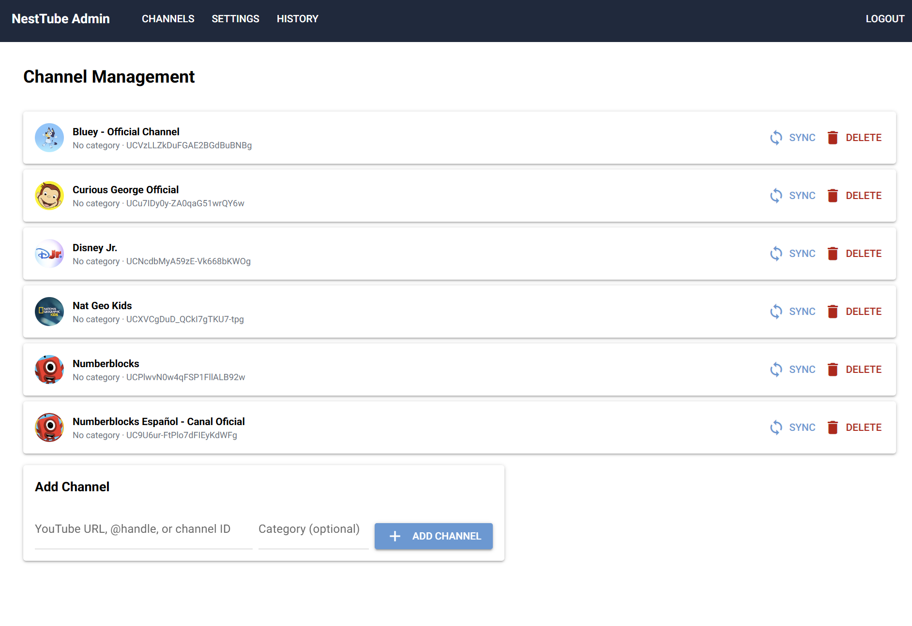
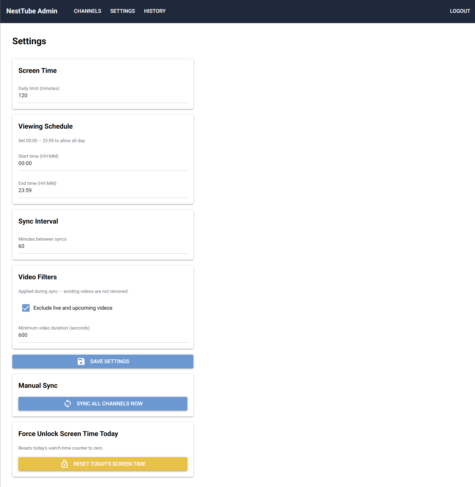

# admin_panel/

The parent administration interface, built with [NiceGUI](https://nicegui.io/). It is a Python-only UI — no separate front-end build step required. NiceGUI is mounted into the same FastAPI application and served at `/admin`.

Access it from any browser on your home network: `http://[pi-ip]:8000/admin` or `http://nesttube.local/admin` if you set the Pi's hostname.

For the TV kiosk app, see [tv_app/README.md](../tv_app/README.md). For full system context, see the [NestTube Design Document](../NestTubeDesign.md).

## Screenshots

### Channel Management

### Settings

## Authentication

The admin panel uses a simple passcode stored as a **bcrypt hash** in the `.env` file. On first visit (when no hash is configured), a setup screen lets you create the passcode — it is immediately written to `.env` and the plain-text value is never recorded anywhere.

Sessions are managed via NiceGUI's server-side user storage (signed with `SECRET_KEY`).

## Pages

### `/admin` — Login
- First-time setup wizard (appears when `ADMIN_PASSCODE_HASH` is empty in `.env`).
- Standard passcode login thereafter.

### `/admin/channels` — Channel Management
- Lists all approved channels with thumbnail, name, category, and channel ID.
- **Add channel** — paste any YouTube URL, `@handle`, or `UC...` channel ID. The app calls the YouTube API to resolve the channel name and thumbnail, then immediately runs an initial video sync.
- **Sync** individual channel on demand.
- **Delete** channel and all its associated cached videos.

### `/admin/settings` — Configuration

| Setting | Default | Description |
|---|---|---|
| Screen time daily limit | 120 minutes | How many minutes of watching are allowed per day |
| Schedule start | 00:00 | Earliest time the TV client is accessible |
| Schedule end | 23:59 | Latest time the TV client is accessible |
| Sync interval | 60 minutes | How often the background job checks for new videos |

Also provides:
- **Sync all channels now** — triggers an immediate full sync without waiting for the scheduler.
- **Reset today's screen time** — sets today's watched counter to zero (emergency unlock).

### `/admin/history` — Watch History
Table showing the last 30 days of watch sessions: date, total time watched, daily limit, and percentage used.

## Implementation Notes

- All pages are registered as `@ui.page` decorators in `panel.py`.
- NiceGUI is wired into FastAPI via `ui.run_with(app)` at the end of `main.py`, so it shares the same process and port as the TV app API.
- The `mount_path="/_nicegui"` keeps NiceGUI's internal assets on a distinct path and avoids conflicts with the TV client's `/static` mount.
