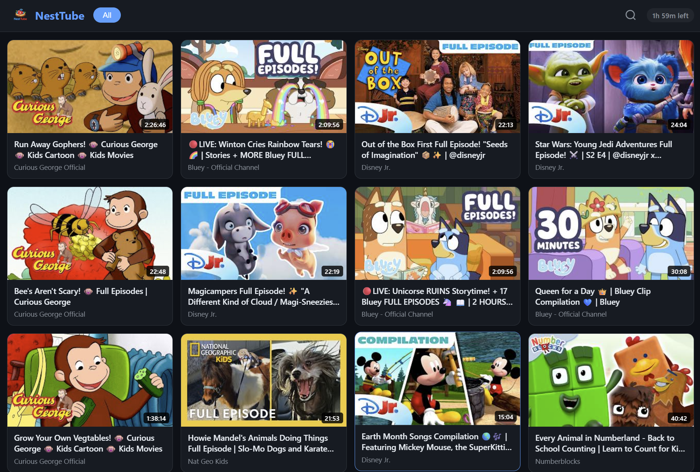
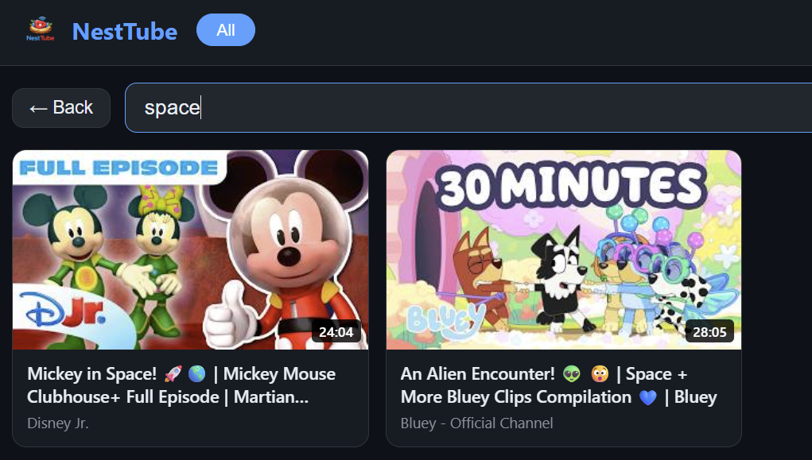

# tv_app/

The TV kiosk application. It has two parts: the **API routers** (Python/FastAPI) that serve data to the front-end, and the **static front-end** (plain HTML/CSS/JavaScript) that Chromium renders in fullscreen kiosk mode.

For the admin panel, see [admin_panel/README.md](../admin_panel/README.md). For full system context, see the [NestTube Design Document](../NestTubeDesign.md).

## Screenshots

### Home Screen

### Search Screen

## API Routers (`routers/`)

All routes are mounted under `/api/` by `main.py`.

| Router | Prefix | Description |
|---|---|---|
| `channels.py` | `/api/channels` | List approved channels and categories |
| `videos.py` | `/api/videos` | Browse the local video catalog (filter by channel or category) |
| `search.py` | `/api/search` | Full-text search against the local SQLite catalog — zero YouTube API quota |
| `session.py` | `/api/session` | Screen-time tracking: get today's status, ping elapsed time, unlock with passcode |

### Screen Time API

| Endpoint | Method | Description |
|---|---|---|
| `/api/session/today` | GET | Returns `total_seconds`, `limit_seconds`, `remaining_seconds`, `is_locked`, `lock_reason` |
| `/api/session/ping` | POST | Accepts `elapsed_seconds` (capped at 120 s server-side to prevent manipulation) and adds to today's total |
| `/api/session/unlock` | POST | Verifies parent passcode and adds 30 minutes to today's limit |

## Static Front-End (`static/`)

A single-page application with five distinct screens, all managed by `app.js` without any framework.

### Screens

| Screen | ID | Description |
|---|---|---|
| Home | `screen-home` | Video grid, rows browsable by category chip |
| Search | `screen-search` | Live search input (debounced 320 ms) against local catalog |
| Player | `screen-player` | YouTube IFrame Player embedded fullscreen |
| Watch Next | `screen-watchnext` | Custom suggestion grid shown immediately after a video ends |
| Lock | `lock-screen` (overlay) | Shown when screen time limit is reached or outside schedule |

### Recommendation Suppression

Two layers work together to ensure YouTube's end-screen recommendations are never visible:

1. **`rel=0` parameter** — IFrame Player restricts related video suggestions to the same channel only.
2. **`ENDED` event interception** — when `onStateChange` fires with state `ENDED (0)`, the iframe is hidden immediately before YouTube renders its end screen. The Watch Next screen is then shown, populated from the local catalog.

### Screen Time Logic

- On boot, the client calls `GET /api/session/today`.
- If `is_locked` is true, the lock overlay is shown immediately.
- While watching, a timer accumulates elapsed seconds. Every 60 seconds, `POST /api/session/ping` is called to persist the time.
- When `remaining_seconds ≤ 300` (5 minutes), a dismissible warning banner appears.
- When `remaining_seconds` reaches 0, the lock screen is shown. A correct parent passcode calls `/api/session/unlock` which adds 30 minutes.
